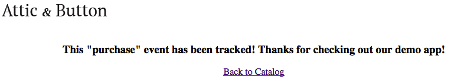

# Optimizely Python SDK Tutorial
This tutorial enables you to quickly get started in your development efforts to create a Python-based webpage with the Optimizely X Python SDK Demo App. This demo package includes an interactive project that illustrates how an online retailer could develop a new feature behind a toggle, roll it out gradually to more users, and run an experiment that tracks a business metric for the new and the old experiences.

The new toggle feature in the demo app allows the user to sort items by price or category, giving the user more control over their view of the products displayed on the page. To roll this feature out, it has been built behind an Optimizely-powered Experiment Variation that provides the ability to gate access without the need to deployment different versions of code.


The demo works as follows:
* Configuration starts by setting up a Project, Experiment, Feature, and Event in the Optimizely dashboard, which will be queried by the demo webpage using the Optimizely Python API.
* The demo consists of a single webpage stored in **./templates/index.html** and a local server listening on Port 4001 that runs the server.
* The main function and UI event handlers for the webpage are defined in **./application.py**.
* The code to create an Optimizely Client instance is defined in **./optimizely_config_manager.py**.
* As the webpage is rendered, the list of products and the names of their associated images are read from **./items.csv**.
* When the user clicks **Shop**, the demo invokes `activate`, passing the user ID entered in the edit field and the experiment ID (`item_sort`). The code then uses the Variation key returned to sort the items accordingly and passes it to the underlying HTML to be used during rendering.
* When the user clicks one of the **Buy Now** buttons, the demo tracks the event by invoking `track`, passing in the event key `item_purchase` and the user ID entered in the edit field.

## Prerequisites
* [Optimizely account](https://app.optimizely.com/signin)
* [Python 2.7+](https://www.python.org) including pip and virtualenv

## Quick start
This section shows you how to prepare the project in the Optimizely portal and run the demo in a browser hosted by a local server.

### Preparing an Optimizely Project
This section provides the steps to prepare an Optimizely project in your dashboard.

1. Clone or download the **python-sdk-demo-app** package.
2. Log in or create an [Optimizely Account](https://app.optimizely.com/signin).
3. Create a project via the Optimizely dashboard.
4. Add a Feature Test with the key `item-sort` and two Variation keys: `price` and `category`. These will act as a toggle for the type of sorting to be permitted.
5. Add an Event key called `item_purchase` and save the event. This event will be triggered when one of the **Buy** buttons is clicked.
6. Navigate to the directory where the package was downloaded to in Step 1 and open **./application.py** in a text editor.
7. Update the following:
 * `<project_id>`: set to the ID of the project created in Step 3.
 * `<experiment_key>`: set to `item-sort`.
 * `<event_key>`: set to `item_purchase`.
8. Save the file. 

### Preparing the Environment

1. Open a terminal window and navigate to the root of the **python-sdk-demo-app** package.
2. Install **pipenv**:
```shell
pip install --user pipenv
```
3. Install **virtualenv** via pip and verify the installation:
```shell
pip install virtualenv
virtualenv --version
```
4. Create the virtual environment for the project: 
```shell
virtualenv demo_app
```
This will create a folder in the current directory which will contain the Python executable files and a copy of the pip library which you can use to install other packages.

Note: `demo_app` can optionally be replaced with any meaningful project name:

5. Start the virtual environment:
```shell
source demo_app/bin/activate
```
6. Verify that the virtual environment is active by ensuring that the project name appears in brackets to the left of the prompt. In the following example `(demo_app)` appears in the prompt, indicating that the virtual environment is active:
```shell
(demo_app) My-Computer:python-sdk-demo-app-master james$ 
```
You can deactivate the virtual environment at any time by entering:
```shell
deactivate
```
Upon deactivation, the project name in brackets will be removed from the prompt.
7. Install the Python requirements for the Demo App: 
```shell
pip install -r requirements.txt
```


### Running the Server and Demo
1. Run the server:
```shell
python application.py
```
The output should look similar to the following:
```shell
 * Running on http://127.0.0.1:4001/ (Press CTRL+C to quit)
 * Restarting with stat
 * Debugger is active!
 * Debugger PIN: 109-869-579
```
2. Open a browser and enter `http://localhost:4001` as the URL. The demo webpage should display.

## How the Test App was Created
The following subsections provide information about key aspects of the demo and how it was put together:
* [Project Structure](#project-structure)
* [Visual Assets](#user-interface-and-visual-assets)
* [User Interface](#user-interface)
* [Styling](#styling)

### Package Structure
The following are the main components in the package:

1. **./application.py**: contains the main Python code for the Demo App that invokes the Optimizely Python APIs.
2. **./optimizely_config_manager.py**: contains a helper class called `OptimizelyConfigManager` that creates the Optimizely client object. Note that **./optimizely_config_manager.py** is the compiled version of this file used by the server.
2. **./images**: contains the art assets for the online store.
3. **./items.csv**: contains information about each product available in the online store.
4. **./requirements.txt**: lists the dependencies required for the project.
5. **./templates**: contains the HTML files for the online store that are rendered in the browser and mapped to the routes exposed by **application.py**.

### Visual Assets
**./items.csv** contains the list of products to sell on the demo website. For each product the file provides the description, color, name, price, and the name of a .png image file to display. The image files are located in **./images**:

|Asset                   |Description                                                                                        |
|------------------------|---------------------------------------------------------------------------------------------------|
|`item_1.png`            |Contains an image of a hat.|
|`item_2.png`            |Contains an image of a pair of shorts.|
|`item_3.png`            |Contains an image of a bag.|
|`item_4.png`            |Contains an image of a dress.|
|`item_5.png`            |Contains an image of a dress .|
|`item_6.png`            |Contains an image of a shirt.|
|`item_7.png`            |Contains an image of a shirt.|
|`item_8.png`            |Contains an image of a shirt.|
|`item_9.png`            |Contains an image of a sweater.|
|`logo.png`              |Contains a logo to display at the top of the online store's page.|

### User Interface

**Main Page**

The base webpage is defined in **./templates/index.html** and is templated so that it's mapped to the routes exposed by **./application.py**. When the application is started, an Optimizely client is created using the `OptimizelyConfigManager` helper class and passing in the ID of the project:
```python
...
PROJECT_ID = 'JamesPyTest'
config_manager = OptimizelyConfigManager(PROJECT_ID)
...
``` 

When the main webpage starts, the `index` handler for the root route gets the information for each of the store's products stored in **./items.csv** using a helper function called `build_items`. The `index` handler then renders the template for the main page defined in **index.html** by passsing the collection of items into `render_template` (`render_template` is a rendering function provided by the [Flask](http://flask.pocoo.org/) framework):
```python
@application.route('/')
def index():
  items = build_items()
  return render_template('index.html', data=items)
```

The template in **./index.html** also sets up submit handlers for the **Shop** and **BUY NOW** buttons that are mapped to the `/shop` and `/buy` routes defined in **./application.py**. These handlers are described below in [Functionality](#functionality).

**Tracking Page**

When the user clicks one of the **BUY NOW** buttons, the `buy` function associated with the `/buy` route defined in **./application.py** extracts the user name entered in the **Simulate a visitor** edit box, and redirects the browser to **./templates/purchase.html** to inform the user that the purchase event is being tracked by Optimizely. The purchase page includes a link called **Back to Catalog** that redirects the browser back to **index.html** when clicked:



### Styling
Both webpages (**./templates/index.html** and **./templates/purchase.html**) reference a basic CSS file located online:
```html
<link rel="stylesheet" href="https://d2uaiq63sgqwfs.cloudfront.net/8.0.0/oui.css">
```

## Configure Resources
To prepare for API usage:
* [Create the Manager Instance](#create-the-manager-instance)

### Create the Manager Instance
**./optimizely_config_manager.py** defines a helper class called `OptimizelyConfigManager` that creates an instance of the Optimizely client:
```python
...
class OptimizelyConfigManager(object):
  obj = None

  def __init__(self, project_id):
    self.project_id = project_id

  def get_obj(self):
    if not self.obj:
      self.set_obj()
    return self.obj

  def set_obj(self, url=None):
    if not url:
      url = 'https://cdn.optimizely.com/json/{0}.json'.format(self.project_id)

    datafile = self.retrieve_datafile(url)
    self.obj = optimizely.Optimizely(datafile, None, SimpleLogger())

    ...
```

When instantiated, the `__init__` method takes in and stores the ID of the project. When client code retrieves the instance, `get_obj` invokes `set_obj` the first time it's called to create the client. `get_obj`  constructs the URL of the datafile using the project ID, retrieves the datafile using that URL, and creates and stores a reference to an Optimizely client using the data file.

## Functionality
The demo illustrates how to:
* [Check a Variation](#check-a-variation)
* [Track the Experiment](#track-the-experiment)

### Check a Variation
When the user clicks the **Shop** button beside the input field, the `shop` handler for the `/shop` route is invoked:
```python
@application.route('/shop', methods=['GET', 'POST'])
def shop():
  user_id = request.form['user_id']
  
  # compute variation_key
  variation_key = config_manager.get_obj().activate('item-sort', user_id)

  # load items
  sorted_items = build_items()
    
  # sort by price
  if variation_key == 'price':
    print("In variation 1")
    sorted_items = sorted(sorted_items, key=itemgetter('price'))

  # sort by category
  if variation_key == 'category':
    print("In variation 2")
    sorted_items = sorted(sorted_items, key=itemgetter('category'))

  #render the index.html template
```

The handler obtains the user ID entered by the user in the edit field. The handler then invokes the `activate` API passing the feature name `item-sort` that was configured above in [Preparing an Optimizely Project](#preparing-an-optimizely-project) and the user ID to get the Variation key. The handler then builds the list of products using the `build_items` helper method and sorts them by price or category if the Variation key obtained is set to `price` or `category` respectively. Finally, the **index.html** template is re-rendered.

### Track the Experiment
When the user clicks one of the **BUY NOW** buttons located below a product image, the `buy` handler for the `/buy` route is invoked: 
```python
@application.route('/buy', methods=['GET', 'POST'])
def buy():
  user_id = request.form['user_id']

  # track conversion event
  config_manager.get_obj().track("item_purchase", user_id)
    
  return render_template('purchase.html')
```

The handler obtains the user ID entered by the user in the input field. The handler then invokes the `track` API, passing in the `item_purchase` event that was configured above in [Preparing an Optimizely Project](#preparing-an-optimizely-project) and the user ID. Finally, the handler redirects the user to **./purchase.html** to inform them about the experiment tracking.

## Additional Resources
* Developer Docs: http://developers.optimizely.com/server
* Questions? Shoot us an email at developers@optimizely.com
